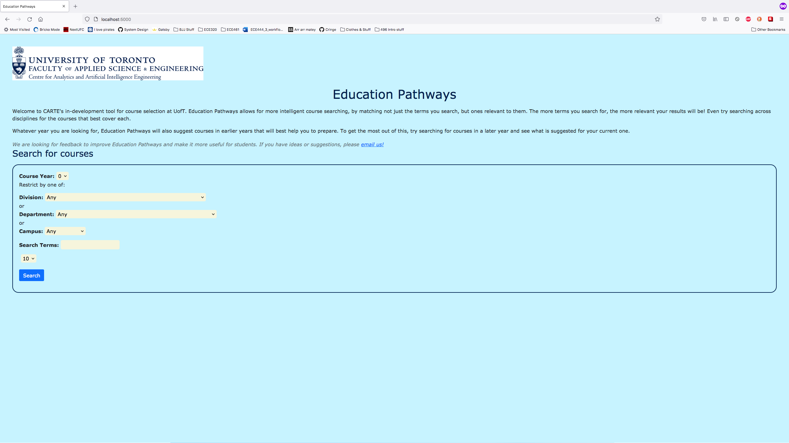

# Stephen Phung

This entire repo is a clone of the Carte Education Pathways repo [here](https://github.com/nelaturuk/education_pathways).

## Activity 1

## Activity 2-5

### Home page

### Results Form page

### Results page

## Activity 6

The colouring of the pages and tables of the updated UI is superior to the old one. This is due to the greater contrast
of elements to eachother. For example, the beige fields for the form on both the Home page and the Results page makes it
far easier for a user to differentiate between what different fields the user can edit. Furthermore, the blue background
also aids this, and is less bright and harsh to view on a bright monitor.